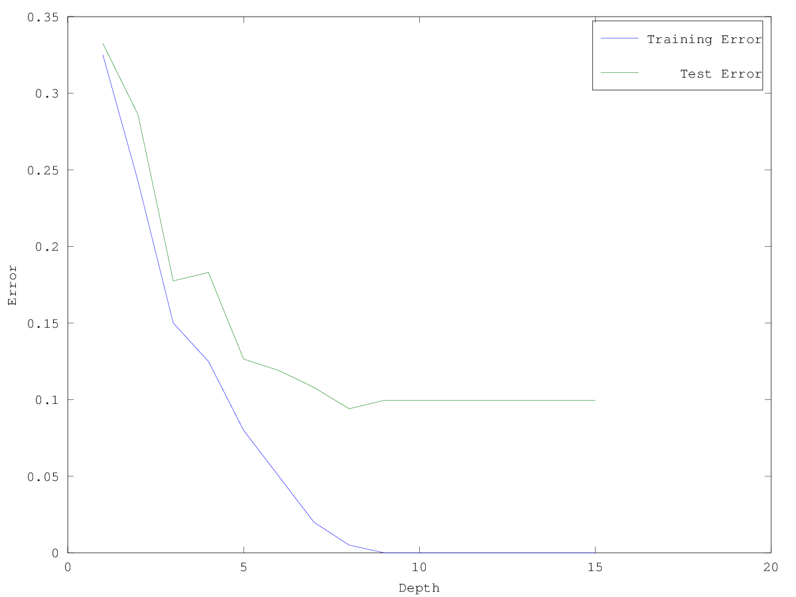
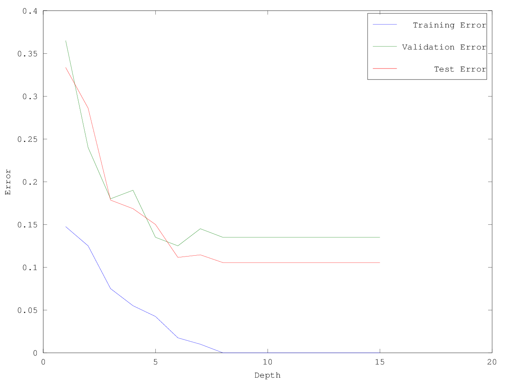

# CS340 Assignment 1
Tristan Rice 25886145, q7w9a

## 1 Data Exporation
### 1.1
#### 1.1.1 The minimum, maximum, mean, median, and mode of all values across the dataset.
```matlab
octave:13> flatX = reshape(X, [], 1)
octave:14> min(flatX)
ans =  0.35200
octave:15> max(flatX)
ans =  4.8620
octave:16> mean(flatX)
ans =  1.3246
octave:17> median(flatX)
ans =  1.1590
octave:18> mode(flatX)
ans =  0.77000
```

#### 1.1.2 The 10%, 25%, 50%, 75%, and 90% quantiles across the dataset.
```matlab
octave:22> quantile(flatX, [0.1 0.25 0.5 0.75 0.9])
ans =

   0.50150
   0.71700
   1.15900
   1.81350
   2.31700
```

#### 1.1.3 The regions with the highest and lowest means, and the highest and lowest variances.
```matlab
octave:67> [m, i] = max(mean(X)); {names(1,i){:}; m}
ans =
{
  [1,1] = WtdILI
  [2,1] =  1.5670
}
octave:68> [m, i] = min(mean(X)); {names(1,i){:}; m}
ans =
{
  [1,1] = Pac
  [2,1] =  1.0632
}
octave:76> [m, i] = max(var(X)); {names(1,i){:}; m}
ans =
{
  [1,1] = Mtn
  [2,1] =  0.79880
}
octave:77> [m, i] = min(var(X)); {names(1,i){:}; m}
ans =
{
  [1,1] = Pac
  [2,1] =  0.32204
}
```

#### 1.1.4. The pairs of regions with the highest and lowest correlations.
```
octave:47> correlation = corr(X)
correlation =

   1.00000   0.98594   0.98264   0.96214   0.94665   0.88676   0.83302   0.70926   0.82083   0.95334
   0.98594   1.00000   0.98788   0.98131   0.97418   0.91225   0.89364   0.76390   0.85915   0.96284
   0.98264   0.98788   1.00000   0.98587   0.97438   0.93742   0.86782   0.73017   0.82493   0.93987
   0.96214   0.98131   0.98587   1.00000   0.98441   0.95234   0.89204   0.73908   0.82066   0.94274
   0.94665   0.97418   0.97438   0.98441   1.00000   0.96802   0.92777   0.79700   0.86013   0.94598
   0.88676   0.91225   0.93742   0.95234   0.96802   1.00000   0.89381   0.74852   0.78819   0.87140
   0.83302   0.89364   0.86782   0.89204   0.92777   0.89381   1.00000   0.91067   0.90423   0.87219
   0.70926   0.76390   0.73017   0.73908   0.79700   0.74852   0.91067   1.00000   0.95380   0.79356
   0.82083   0.85915   0.82493   0.82066   0.86013   0.78819   0.90423   0.95380   1.00000   0.87783
   0.95334   0.96284   0.93987   0.94274   0.94598   0.87140   0.87219   0.79356   0.87783   1.00000
```
Lowest correlation is between NE(1) and Mtn(8). Highest correlation is between
MidAtl(2) and ENCentral(3).


#### In light of parts 1 and 2, is the mode a reliable estimate of the most “common” value? Describe another way we could give a meaningful “mode” measurement for this (continuous) data

### 1.2

#### 1.2.1 A plot containing the weeks on the x-axis and the percentages for each region on the y-axis.
\

```matlab
plot(X)
xlabel("Week")
ylabel("Percentage")
legend(names{:})
print -dpng 1.2.1.png
```

#### 1.2.2 A boxplot grouping data by weeks, showing the distribution across regions for each week.
\

```matlab
boxplot(X')
xlabel("Week")
ylabel("Distribution")
print -dpng 1.2.2.png
```

#### 1.2.3 A histogram showing the distribution of each the values in the matrix X.
\

```matlab
flatX = reshape(X, [], 1)
hist(flatX)
xlabel("Distribution")
ylabel("Frequency")
print -dpng 1.2.3.png
```

#### 1.2.4 A single histogram showing the distribution of each column in X.
\

```matlab
hist(X)
legend(names{:})
xlabel("Distribution")
ylabel("Frequency")
print -dpng 1.2.4.png
```

#### 1.2.5 A scatterplot between the two regions with lowest correlation.
\

```matlab
scatter(X(:,1), X(:,8))
xlabel("Percentage - NE")
ylabel("Percentage - Mtn")
print -dpng 1.2.5.png
```


#### 1.2.6 A scatterplot between the two regions with highest correlation
\

```matlab
scatter(X(:,2), X(:,3))
xlabel("Percentage - MidAtl")
ylabel("Percentage - ENCentral")
print -dpng 1.2.6.png
```

## 2
### 2.1
```
Error with majority predictor: 0.41
Error with equality-rule decision stump: 0.41
Error with decision stump: 0.25


 70 +-+---------+-----------+-----------+----------+-----------+---------+-+
    +         F +       F   +           +          +           +           +
    |                                                                      |
    |                                                                      |
 60 +-+                                                                  +-+
    |                                                                      |
    |       F                                                              |
    |                                                                      |
 50 +-+                                 A         FF A                   +-+
    |                                 A  A       F F AAAAAA AA        A    |
    |                                FFF F  FF F  F FAAAAAA AA AAAAAAAA    |
 40 +-+                              A   A      A  FFFAAFAAAAAAAAAAAAA   +-+
    |                                 AA     F  A   FFFFFAAAFFAAAAA        |
    |                                 A  AA     AA  FF  FF FFFAFFA         |
    |                                   AAA FF   A FFFFF FFFFFFF           |
 30 +-+                                          F FFFFFFFF  FA          +-+
    |                                               FF        A            |
    |                                                         AA           |
    +           +           +           +          +           +           +
 20 +-+---------+-----------+-----------+----------+-----------+---------+-+
  -180        -160        -140        -120       -100         -80         -60
```


### 2.2
```matlab
function [model] = decisionTreeHand(X,y,maxDepth)
    model.predict = @predict;
end

function [y] = predict(model,X)
  [t,d] = size(X);
  y = zeros(t,1);
  for i = 1:t;
    v = 0;
    if X(i,2) >= 37.695
      if X(i,1) >= -96.033
        v = 1;
      else
        v = 2;
      end
    else
      if X(i,1) >= -112.55
        v = 2;==
      else
        v = 1;
      end
    end
    y(i, 1) = v;
  end
end
```

#### Why does the training error stop decreasing when you use classification accuracy?
It stops decreasing because it no longer over fits to the data. The
classification accuracy increases because the model is more general.

### 2.3 Cost of Fitting Decision Trees
Since on average each decision stump splits the search space in two, n halves
every stump.
```
T(n) = n*d*log(n) + 2T(n/2)
T(n) = n*d*log(n) + n*d*log(n/2) + 4T(n/4)
T(n) = n*d*log(n) + n*d*log(n/2) + n*d*log(n/4) + 8T(n/8)
T(n) = d * (sum from i=1 to m of n*log(n/(2^i)))
O(m*d*n*log(n))
```
Could also have a decision tree where each decision stump only has one side
with another decision stump.
```
T(n) = n*d*log(n) + T(n-1)
T(n) = sum_1^m(i*d*log(i)) <= m*d*n*log(n)
O(m*d*n*log(n))
```
We get the same result in both cases, despite having a rather loose upper bound.

## 3 Training and Testing
### 3.1 Training and Testing Error Curves
\

As the depth gets higher, the training error gets close to zero as the tree fits
exactly to the training data. Test error however, flattens out (and actually
gets slightly worse due to over fitting) as the depth gets deeper.

### 3.2 Validation Set
Switched validation set.

\

If we minimize the validation set error we would pick a depth of 3. If we switch
the training and validation set, we would pick a depth of 6. This inconsistency
is probably due to not having enough training data.

## 4 Naive Bayes
### 4.1 Bayes rule for drug testing
```
P(T=1|D=1) = 0.99
P(T=0|D=0) = 0.99
P(D=1) = 0.001
P(D=0) = 0.999
P(D=1|T=1) = ?
P(D=1|T=1) = P(T=1|D=1)*P(D=1)/P(T=1)
P(T=1) = P(T=1|D=1)*P(D=1)+P(T=1|D=0)*P(D=0)
P(T=1|D=0) = 0.01
P(D=1|T=1) = 0.99 * 0.001 / (0.99*0.001 + 0.01*0.999)
P(D=1|T=1) = 0.09016393442
```
### 4.2 Naive Bayes by Hand
#### a) Compute the estimates of the class prior probablities:
```
p(y=1) = 6/10 = 3/5
p(y=0) = 4/10 = 2/5
```

#### b) Compute the estimates of the 4 conditional probabilities required by naive Bayes for this example:
```
P(x1 = 1|y = 1) = 3/6 = 1/2
P(x2 = 1|y = 1) = 4/6 = 2/3
P(x1 = 1|y = 0) = 4/4 =   1
P(x2 = 1|y = 0)       = 1/4
```

#### c) Under the naive Bayes model and your estimates of the above probabilities, what is the most likely label for the test example? (Show your work)
```
P(y = 1|x1 = 1, x2 = 1) = P(y = 1)*P(x1 = 1|y = 1)*P(x2 = 1|y = 1)
                        = 3/5 * 1/2 * 2/3
                        = 0.2
P(y = 0|x1 = 1, x2 = 1) = P(y = 0)*P(x1 = 1|y = 0)*P(x2 = 1|y = 0)
                        = 2/5 * 1 * 1/4
                        = 0.1
```
Thus, the most likely label is `y = 1` since `0.2 > 0.1`.

### 4.3 Naive Bayes Implementation
```matlab
function [model] = naiveBayes(X,y)
% [model] = naiveBayes(X,y,k)
%
% Implementation of navie Bayes classifier for binary features

% Compute number of training examples and number of features
[n,d] = size(X);

% Computer number of class lables
k = max(y);

counts = zeros(k,1);
for c = 1:k
    counts(c) = sum(y==c);
end
p_y = counts/n; % This is the probability of each class, p(y(i) = c)

% We will store:
%   p(x(i,j) = 1 | y(i) = c) as p_xy(j,1,c)
%   p(x(i,j) = 0 | y(i) = c) as p_xy(j,2,c)
p_xy = (1/2)*ones(d,2,k);
for j = 1:d
    for c = 1:k
        p_xy(j, 1, c) = sum(X(:, j)==1 & y==c)/counts(c);
        p_xy(j, 2, c) = sum(X(:, j)==0 & y==c)/counts(c);
    end
end

model.k = k;
model.p_y = p_y;
model.p_xy = p_xy;
model.predict = @predict;
end

function [yhat] = predict(model,Xtest)
[t,d] = size(Xtest);
k = model.k;
p_y = model.p_y;
p_xy = model.p_xy;

yhat = zeros(t,1);
for i = 1:t
    probs = p_y; % This will be the probability for each class
    for j = 1:d
        if Xtest(i,j) == 1
            for c = 1:k
                probs(c) = probs(c)*p_xy(j,1,c);
            end
        else
            for c = 1:k
                probs(c) = probs(c)*p_xy(j,2,c);
            end
        end
    end
    [maxProb,yhat(i)] = max(probs);
end
end
```
Validation error is 0.19.

### 4.4 Runtime of Naive Bayes for Discrete Data
The runtime of classification does depend on `n`. We have to run the
classification for every test object and calculate the probability of every
class label to find the max. To find the probability of a class label we need
perform Bayes rule with each feature.

Thus `O(t * k * c * d)`.
