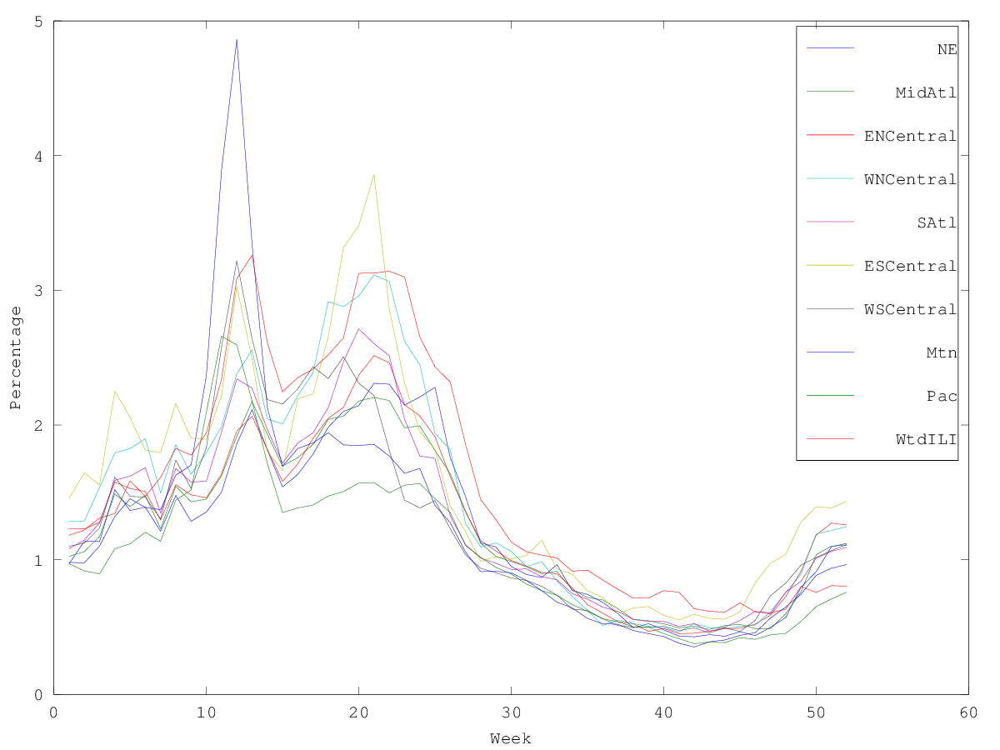
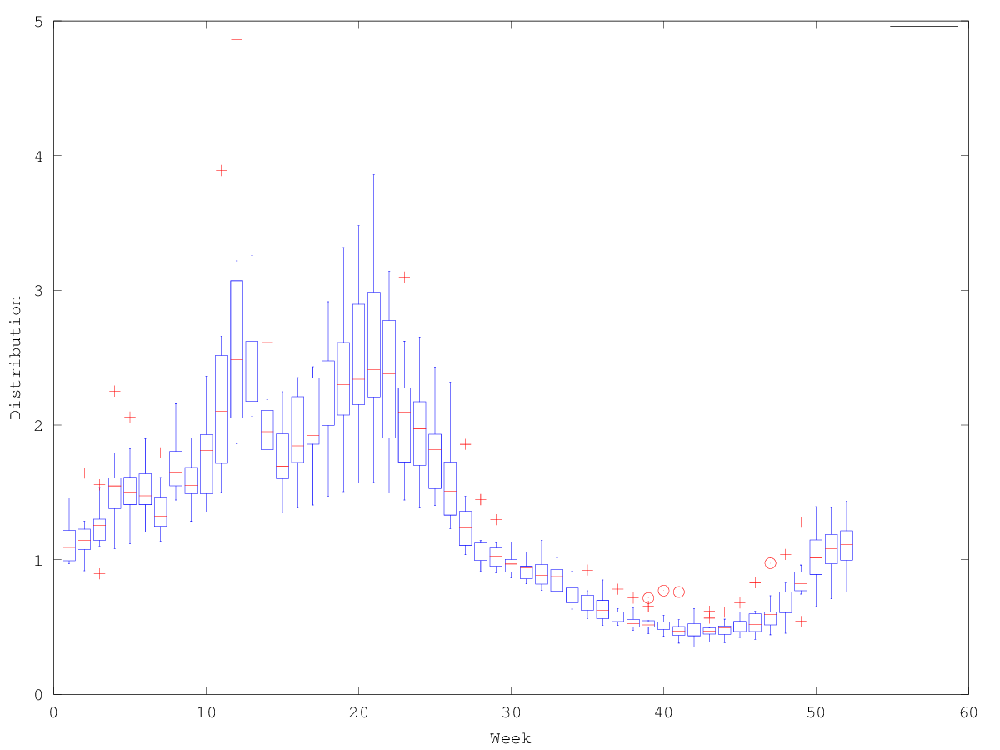
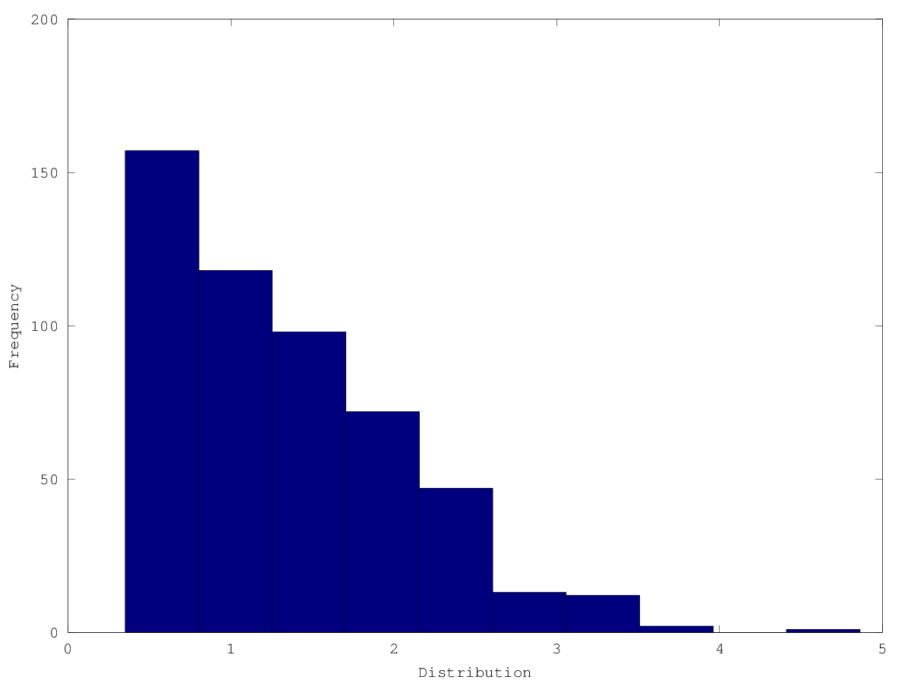
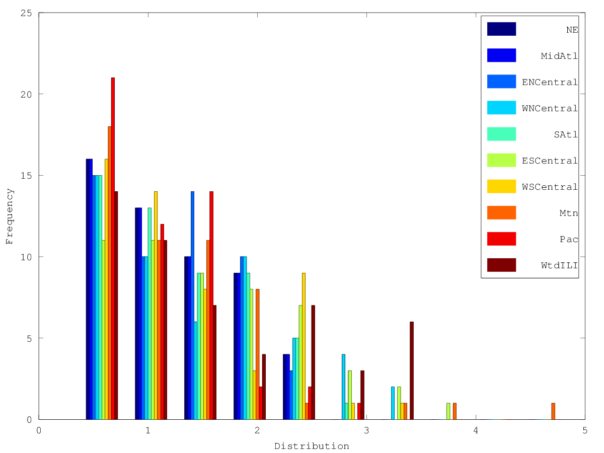
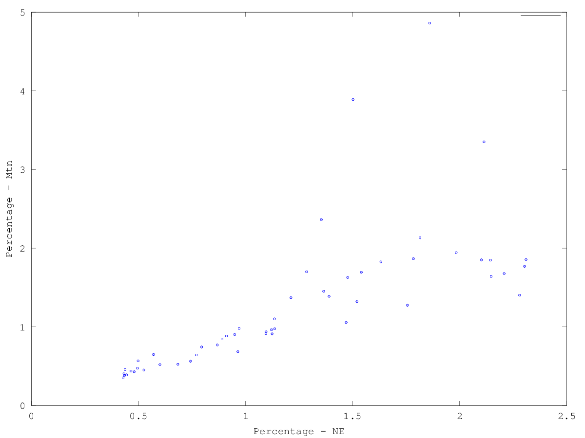
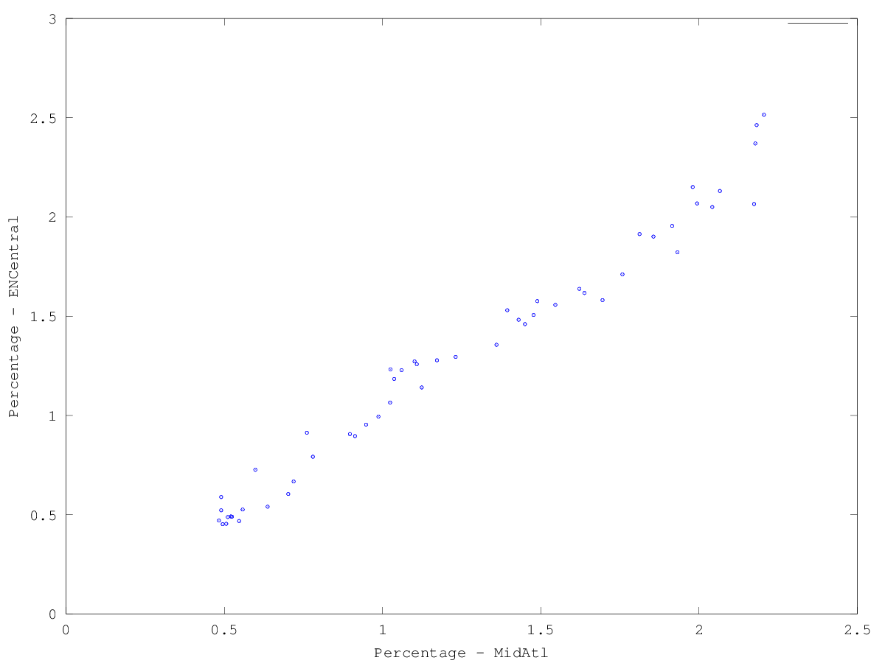

# CS340 Assignment 1
Tristan Rice 25886145, q7w9a

## 1 Data Exporation
### 1.1
#### 1. The minimum, maximum, mean, median, and mode of all values across the dataset.
```matlab
octave:13> flatX = reshape(X, [], 1)
octave:14> min(flatX)
ans =  0.35200
octave:15> max(flatX)
ans =  4.8620
octave:16> mean(flatX)
ans =  1.3246
octave:17> median(flatX)
ans =  1.1590
octave:18> mode(flatX)
ans =  0.77000
```

#### 2. The 10%, 25%, 50%, 75%, and 90% quantiles across the dataset.
```matlab
octave:22> quantile(flatX, [0.1 0.25 0.5 0.75 0.9])
ans =

   0.50150
   0.71700
   1.15900
   1.81350
   2.31700
```

#### 3. The regions with the highest and lowest means, and the highest and lowest variances.
```matlab
octave:67> [m, i] = max(mean(X)); {names(1,i){:}; m}
ans =
{
  [1,1] = WtdILI
  [2,1] =  1.5670
}
octave:68> [m, i] = min(mean(X)); {names(1,i){:}; m}
ans =
{
  [1,1] = Pac
  [2,1] =  1.0632
}
octave:76> [m, i] = max(var(X)); {names(1,i){:}; m}
ans =
{
  [1,1] = Mtn
  [2,1] =  0.79880
}
octave:77> [m, i] = min(var(X)); {names(1,i){:}; m}
ans =
{
  [1,1] = Pac
  [2,1] =  0.32204
}
```

#### 4. The pairs of regions with the highest and lowest correlations.
```
octave:47> correlation = corr(X)
correlation =

   1.00000   0.98594   0.98264   0.96214   0.94665   0.88676   0.83302   0.70926   0.82083   0.95334
   0.98594   1.00000   0.98788   0.98131   0.97418   0.91225   0.89364   0.76390   0.85915   0.96284
   0.98264   0.98788   1.00000   0.98587   0.97438   0.93742   0.86782   0.73017   0.82493   0.93987
   0.96214   0.98131   0.98587   1.00000   0.98441   0.95234   0.89204   0.73908   0.82066   0.94274
   0.94665   0.97418   0.97438   0.98441   1.00000   0.96802   0.92777   0.79700   0.86013   0.94598
   0.88676   0.91225   0.93742   0.95234   0.96802   1.00000   0.89381   0.74852   0.78819   0.87140
   0.83302   0.89364   0.86782   0.89204   0.92777   0.89381   1.00000   0.91067   0.90423   0.87219
   0.70926   0.76390   0.73017   0.73908   0.79700   0.74852   0.91067   1.00000   0.95380   0.79356
   0.82083   0.85915   0.82493   0.82066   0.86013   0.78819   0.90423   0.95380   1.00000   0.87783
   0.95334   0.96284   0.93987   0.94274   0.94598   0.87140   0.87219   0.79356   0.87783   1.00000
```
Lowest correlation is between NE(1) and Mtn(8). Highest correlation is between
MidAtl(2) and ENCentral(3).


#### In light of parts 1 and 2, is the mode a reliable estimate of the most “common” value? Describe another way we could give a meaningful “mode” measurement for this (continuous) data

### 1.2

#### 1. A plot containing the weeks on the x-axis and the percentages for each region on the y-axis.

```
plot(X)
xlabel("Week")
ylabel("Percentage")
legend(names{:})
print -dpng 1.2.1.png
```

#### 2. A boxplot grouping data by weeks, showing the distribution across regions for each week.

```
boxplot(X')
xlabel("Week")
ylabel("Distribution")
print -dpng 1.2.2.png
```

#### 3. A histogram showing the distribution of each the values in the matrix X.

```
flatX = reshape(X, [], 1)
hist(flatX)
xlabel("Distribution")
ylabel("Frequency")
print -dpng 1.2.3.png
```

#### 4. A single histogram showing the distribution of each column in X.

```
hist(X)
legend(names{:})
xlabel("Distribution")
ylabel("Frequency")
print -dpng 1.2.4.png
```

#### 5. A scatterplot between the two regions with lowest correlation.

```
scatter(X(:,1), X(:,8))
xlabel("Percentage - NE")
ylabel("Percentage - Mtn")
print -dpng 1.2.5.png
```


#### 6. A scatterplot between the two regions with highest correlation

```
scatter(X(:,2), X(:,3))
xlabel("Percentage - MidAtl")
ylabel("Percentage - ENCentral")
print -dpng 1.2.6.png
```


