# 1 K-Nearest Neighbours
## 1.1 KNN Prediction

### 1.1.1 Handin your predict function.

```matlab
function [yhat] = predict(model,Xtest)
  % compute euclidian distance
  % distances = sum((model.X - Xtest).**2, 2);
  [n,d] = size(model.X);
  [t,d] = size(Xtest);

  distances = model.X.^2*ones(d,t) + ones(n,d)*(Xtest').^2 - 2*model.X*Xtest';
  yhat = zeros(t, 1);
  for c = 1:t
    [dists,  idx] = sort(distances(:, c));
    yhat(c) = mode(model.y(idx(1:model.k, :)));
  end
end
```

### 1.1.2 Report the training and test error obtained on the citiesSmall.mat dataset for k = 1, k = 3, and k = 10.

```
Training error with k-1 knn: 0.000
Test error with k-1 knn: 0.065
Training error with k-3 knn: 0.028
Test error with k-3 knn: 0.066
Training error with k-10 knn: 0.072
Test error with k-10 knn: 0.097
```

### 1.1.3 Hand in the plot generatied by classifier2Dplot on the citiesSmall.mat dataset for k = 1. (Note that this version of the function also plots the test data.)

\

### 1.1.4 Why is the training error 0 for k = 1?

Since all the training data forms the model, when k = 1 the training data
matches exactly the test data thus the distance is zero. It finds the exact
matching point in the training data.

### 1.1.5 If you didn’t have an explicit test set, how would you choose k?

You could split the training set in half and use one half for training and one
for testing. Alternatively you could make an educated guess for k.

## 1.2 Condensed Nearest Neighbours

### 1.2.1. Hand in your cnn.m code.

```matlab
function [model] = cnn(X,y,k)
  % [model] = cnn(X,y,k)
  %
  % Implementation of condensed-nearest neighbour classifer

  % Always add the first point as a start.
  model.X = X(1, :);
  model.y = y(1, :);
  model.k = k;
  model.c = max(y);
  model.predict = @predict;

  [n, d] = size(X);
  for i = 2:n
    if model.predict(model, X(i, :)) != y(i)
      model.X = [model.X; X(i, :)];
      model.y = [model.y; y(i)];
    end
  end
end

function [yhat] = predict(model,Xtest)
  % compute euclidian distance
  % distances = sum((model.X - Xtest).**2, 2);
  [n,d] = size(model.X);
  [t,d] = size(Xtest);

  distances = model.X.^2*ones(d,t) + ones(n,d)*(Xtest').^2 - 2*model.X*Xtest';
  yhat = zeros(t, 1);
  for c = 1:t
    [dists,  idx] = sort(distances(:, c));
    yhat(c) = mode(model.y(idx(1:min(n, model.k), :)));
  end
end
```

### 1.2.2. Report the training and testing errors, as well as the number of objects in the subset, on the citiesBig1.mat dataset with k = 1.

```
Number of objects in model 457 of 14735
Training error with k-1 cnn: 0.008
Test error with k-1 cnn: 0.018
```

### 1.2.3. Hand in the plot generated by classifier2Dplot on the citiesBig1.mat dataset for k = 1

\

### 1.2.4. Why is the training error with k = 1 now greater than 0?

It's now greater than zero because not all of the provided training points are
included in the model. Only those that improve the classifier score.

### 1.2.5. If you have s examples in the subset, what is the cost of running the predict function on t test examples in terms of n, d, t, and s?

It comes out to be $t * d * s$. Doesn't depend on n since s is a subset of n.

### 1.2.6. Try out your function on the dataset in citiesBig2.mat. Why are the test error and training error so high (even for k = 1) for this method on this dataset?

```
Training error with k-1 knn: 0.138
Test error with k-1 knn: 0.210
```

Probably because there's a lot of datapoints near the edge of regions. It has
lots of variation so is hard to predict.

# 2. Random Forests

## 2.1. Random Trees

### 2.1.1. Make a plot of the training error and the test error for the decisionTree model, as the depth is varied from 1 to 15.

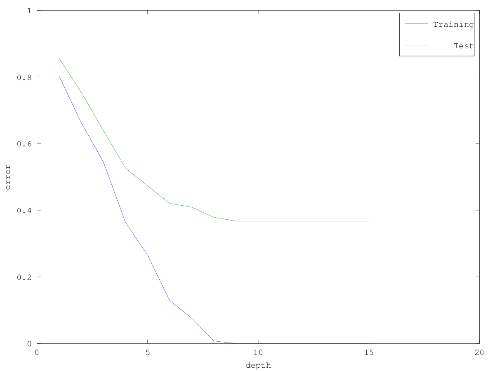\

### 2.1.2. Why does the decisionTree function terminate if you set the depth parameter to ∞?

It terminates because every variable has been fit, and the model is so overfit
it exactly matches the training data. When there are no more possible rules that
increase information gain, the algorithm stops.

### 2.1.3. Copy the decisionStump function to a new function called randomStump. Modify the randomStump so that it only considers b √ dc randomly-chosen features. Hand in the new training function and make a plot of the training and test error of the now-working randomTree model as the depth is varied from 1 to 15 with this method (it should not be the same every time, so just include one run of the method).

```matlab
function [model] = randomStump(X,y)
% [model] = randomStump(X,y)
%
% Fits a decision stump that splits on a single variable.

% Compute number of training examples and number of features
[n,d] = size(X);

% Computer number of class lables
k = max(y);

% Address the trivial case where we do not split
count = accumarray(y,ones(size(y)),[k 1]); % Counts the number of occurrences of each class
[maxCount,maxLabel] = max(count);

% Compute total entropy (needed for information gain)
p = count/sum(count); % Convert counts to probabilities
entropyTotal = -sum(p.*log0(p));

maxGain = 0;
splitVariable = [];
splitThreshold = [];
splitLabel0 = maxLabel;
splitLabel1 = [];

% Loop over sqrt(d) random features looking for the best split
if any(y ~= y(1))
    for j = floor(rand(1,sqrt(d))*d+1)
        thresholds = sort(unique(X(:,j)));

        for t = thresholds'

            % Count number of class labels where the feature is greater than threshold
            yVals = y(X(:,j) > t);
            count1 = accumarray(yVals,ones(size(yVals)),[k 1]);
            count0 = count-count1;

            % Compute infogain
            p1 = count1/sum(count1);
            p0 = count0/sum(count0);
            H1 = -sum(p1.*log0(p1));
            H0 = -sum(p0.*log0(p0));
            prob1 = sum(X(:,j) > t)/n;
            prob0 = 1-prob1;
            infoGain = entropyTotal - prob1*H1 - prob0*H0;

            % Compare to minimum error so far
            if infoGain > maxGain
                % This is the lowest error, store this value
                maxGain = infoGain;
                splitVariable = j;
                splitThreshold = t;

                % Compute majority class
                [maxCount,splitLabel1] = max(count1);
                [maxCount,splitLabel0] = max(count0);
            end
        end
    end
end
model.splitVariable = splitVariable;
model.splitThreshold = splitThreshold;
model.label1 = splitLabel1;
model.label0 = splitLabel0;
model.predict = @predict;
end
```

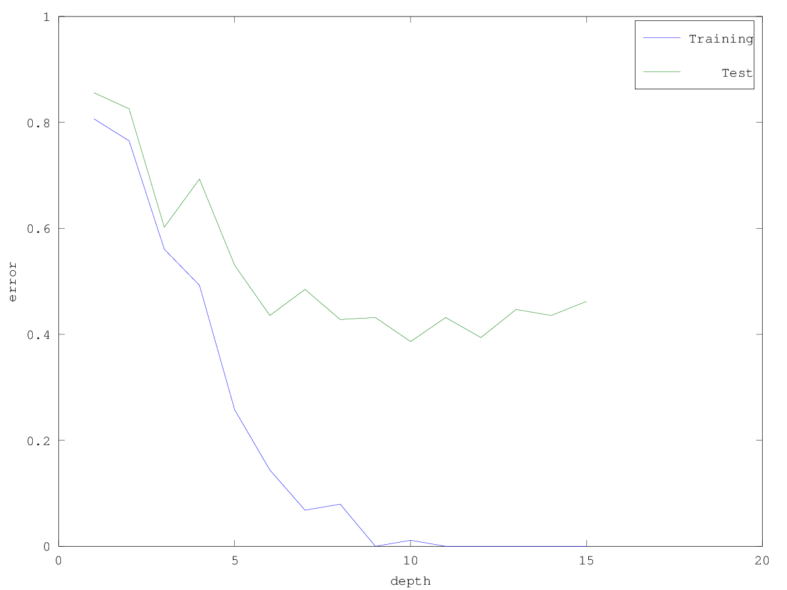\

### 2.1.4. Make a third training/test plot where you use the decisionTree model but for each depth you train on a different boostrap sample of the training data (but evaluate the training error on the original training data).

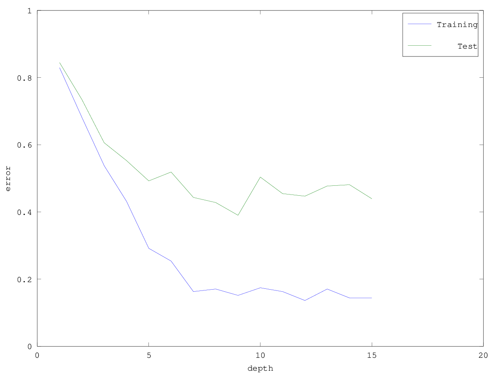\


## 2.2. Random Decision Forests

### 2.2.1. Report the test error of the decisionForest classifier with a depth of ∞ and 50 trees.

```
Training error with depth-Inf decision forest: 0.00
Test error with depth-Inf decision forest: 0.37
```

### 2.2.2. Report the test error of the decisionForest classifier with a depth of ∞ and 50 trees, if each tree is trained on a different boostrap sample.

```
Training error with depth-Inf decision forest: 0.00
Test error with depth-Inf decision forest: 0.29
```

### 2.2.3. Report the test error of the decisionForest classifier with a depth of ∞ and 50 trees, if you train on the original dataset but use randomTree instead decisionTree to fit the models.

```
Training error with depth-Inf decision forest: 0.00
Test error with depth-Inf decision forest: 0.17
```

### 2.2.4. Report the test error of the decisionForest classifier with a depth of ∞ and 50 trees, if you use randomTree and each tree is trained on a different boostrap sample. Hand in your modified decisionForest.m function (which is now a random forest model).

```octave
function [model] = decisionForest(X,y,depth,nBootstraps)

% Fit model to each boostrap sample of data
for m = 1:nBootstraps
    Xbootstrap = X;
    ybootstrap = y;
    n = rows(X);
    for i = 1:n
        j = ceil(rand * n);
        Xbootstrap(i,:) = X(j,:);
        ybootstrap(i,:) = y(j,:);
    end
    model.subModel{m} = randomTree(Xbootstrap,ybootstrap,depth);
end

model.predict = @predict;

end

function [y] = predict(model,X)

% Predict using each model
for m = 1:length(model.subModel)
    y(:,m) = model.subModel{m}.predict(model.subModel{m},X);
end

% Take the most common label
y = mode(y,2);
end
```

```
Training error with depth-Inf decision forest: 0.00
Test error with depth-Inf decision forest: 0.17
```

### 2.2.5. What is the effect of the two ingredients of random forests, bootstrapping and random splits, on the performance on this dataset?

They both improve the accuracy of the model. However, random splits has a much
bigger impact on the testing error than bootstrapping. The final accuracy of the
model was the same with both as just with random splits.

# 3. K-Means Clustering

## 3.1. Selecting among Initializations

### 3.1.1. In the clusterKmeans.m file, add a new function called error that takes the same input as the predict function but that returns the value of this above objective function. Hand in your code.

```octave
function [e] = error(model,X)
  c = model.predict(model,X);
  e = sum(sum((X-model.W(c,:)).^2));
end
```

### 3.1.2. Using the clustering2Dplot file, output the clustering obtained by running k-means 50 times (with k = 4) and taking the one with the lowest error.

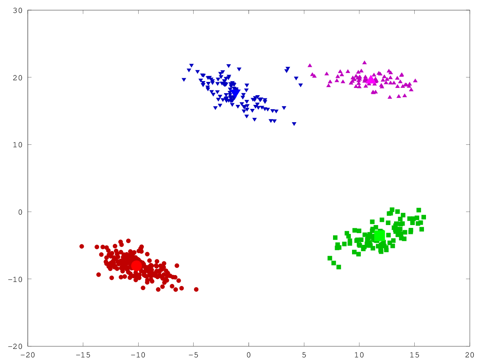\

## 3.2. Selecting k

### 3.2.1. Explain why the above objective function cannot be used to choose k.

You can't use the above clustering function because when $k=n$, that function
will return zero. The perfect cluster according to that is when every node is
it's own cluster. This is less than ideal.

### 3.2.2. Explain why even evaluating this objective function on test data still wouldn’t be a suitable approach to choosing k.

It violates the sacred law of machine learning. Don't use your test data when
training.

### 3.2.3. Hand in a plot of the minimum error found across 50 random initializations, as you vary k from 1 to 10.

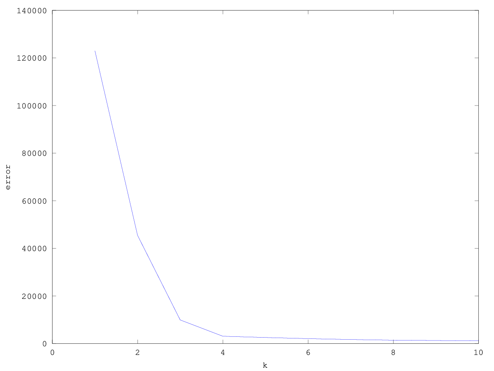\

### 3.2.4. The elbow method for choosing k consists of looking at the above plot and visually trying to choose the k that makes the sharpest “elbow” (the biggest change in slope). What values of k might be reasonable according to this method?

The elbow occurs around 3-4. Before 3 and beyond 4 the difference in slope is very minimal.

## 3.3. k-Medians

### 3.3.1. Using the clustering2Dplot file, output the clustering obtained by running k-means 50 times (with k = 4) on clusterData2.mat and taking the one with the lowest error.

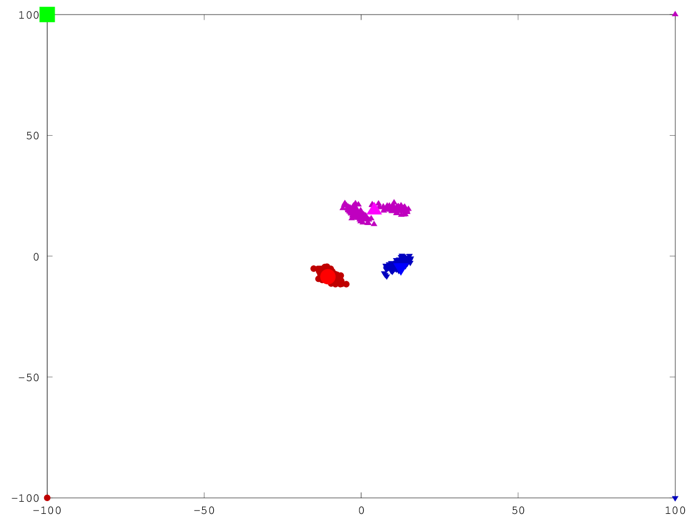\

### 3.3.2. What values of k might be chosen by the elbow method for this dataset?

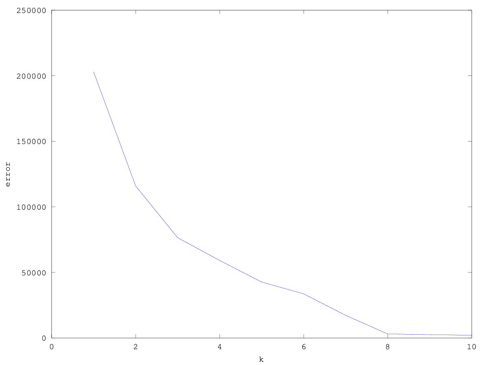\

The two most drastic differences in slopes is at k=3, and k=8.

### 3.3.3. Implement the k-medians algorithm, which assigns examples to the nearest $w_c$ in the L1-norm and to updates the $w_c$ by setting them to the “median” of the points assigned to the cluster (we define the d-dimensional median as the concatenation of the median of the points along each dimension). Hand in your code.

```octave
function [model] = clusterKmedians(X,k,doPlot)
% [model] = clusterKmedians(X,k,doPlot)
%
% K-medians clustering

[n,d] = size(X);
y = ones(n,1);

% Choose random points to initialize median
W = zeros(k,d);
for k = 1:k
    i = ceil(rand*n);
    W(k,:) = X(i,:);
end

X2 = X.^2*ones(d,k);
while 1
    y_old = y;

    % Draw visualization
    if doPlot && d == 2
        clustering2Dplot(X,y,W)
    end

    % Compute (squared) Euclidean distance between each data point and each
    % median
    distances = X2 + ones(n,d)*(W').^2 - 2*X*W';

    % Assign each data point to closest median
    [~,y] = min(distances,[],2);

    % Draw visualization
    if doPlot && d == 2
        clustering2Dplot(X,y,W)
    end

    % Compute median of each cluster
    for k = 1:k
        tX = X(y==k,:);
        %size(tX)
        if rows(tX) != 0
          W(k,:) = median(tX,1);
        end
    end

    changes = sum(y ~= y_old);

    % Stop if no point changed cluster
    if changes == 0
        break;
    end
end

model.W = W;
model.y = y;
model.predict = @predict;
model.error = @error;
end

function [y] = predict(model,X)
[t,d] = size(X);
W = model.W;
k = size(W,1);

% Compute Euclidean distance between each data point and each median
X2 = X.^2*ones(d,k);
distances = sqrt(X2 + ones(t,d)*(W').^2 - 2*X*W');

% Assign each data point to closest median
[~,y] = min(distances,[],2);
end

function [e] = error(model,X)
  c = model.predict(model,X);
  e = sum(sum(abs(X-model.W(c,:))));
end
```

### 3.3.4. Using the L1-norm version of the error what value of k would be chosen by the elbow method under this strategy?

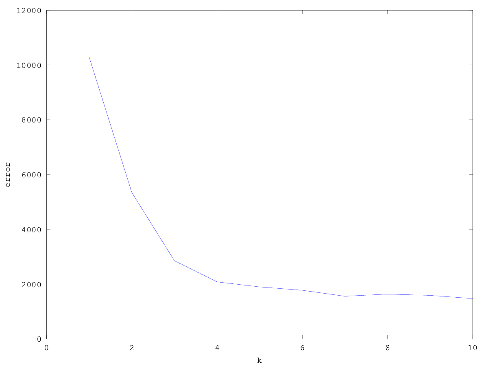\

Looks like a k value of 4 would be optimal with 3 being a close second.

# 4. Vector Quantization and Density-Based Clustering

## 4.1 Image Colour-Space Compression

### 4.1.1. Hand in your quantizeImage function.

```octave
function [Iquant] = quantizeImage(I,b)
  [height, width, d] = size(I);
  flattened = reshape(I, height*width, d);
  model = clusterKmeans(flattened, 2^b, 0);
  out = model.W(model.predict(model,flattened),:);
  Iquant = reshape(out, height, width, d);
end
```

### 4.1.2. Show the image obtained if you encode the colours using 1, 2, 4, and 6 bits.

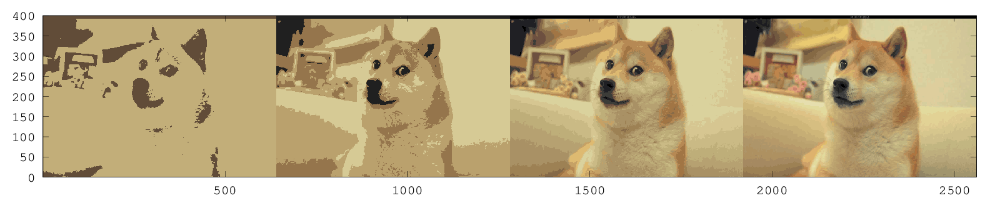\

## 4.2. Effect of Parameters on DBSCAN

Find and report values for the two parameters (radius and minPts) such that the
density-based clustering method finds:

### 4.2.1. The 4 “true” clusters.

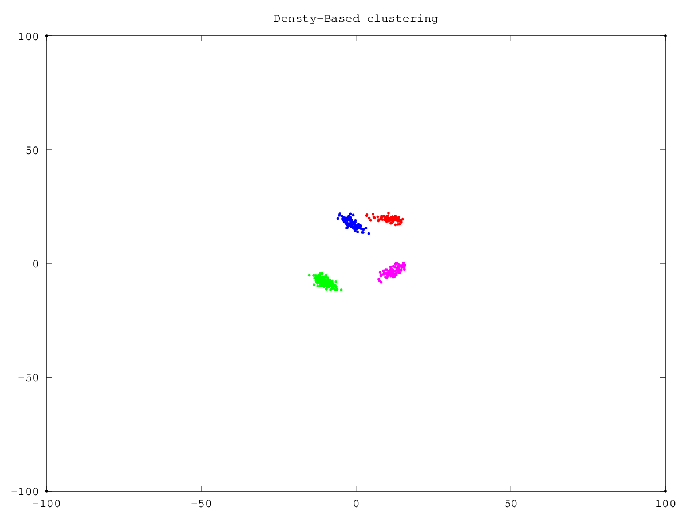\

```
radius = 4, minPts = 3
```

### 4.2.2. 3 clusters (merging the top two, which also seems like a reasonable interpretaition).

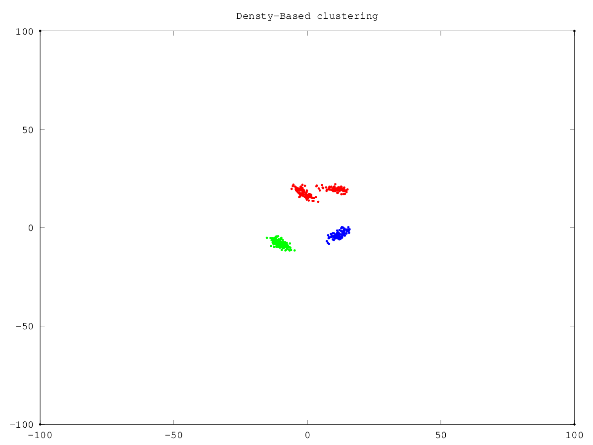\

```
radius = 16, minPts = 3
```

### 4.2.3. 2 clusters.

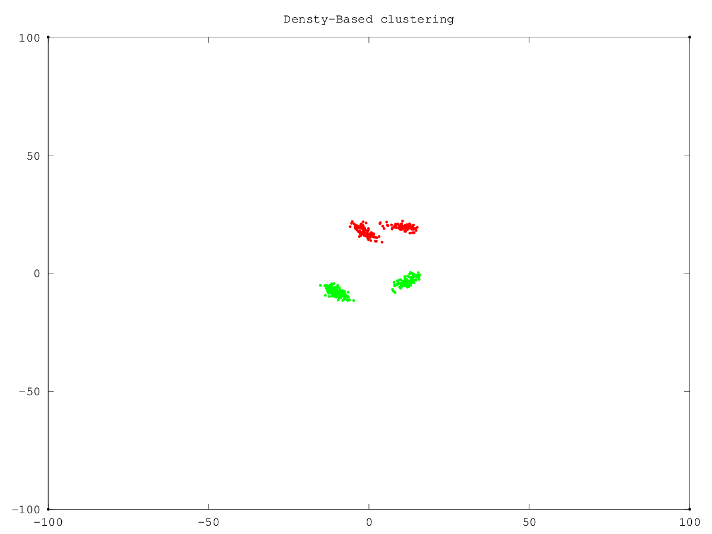\

```
radius = 200, minPts = 3
```

### 4.2.4. 1 cluster.

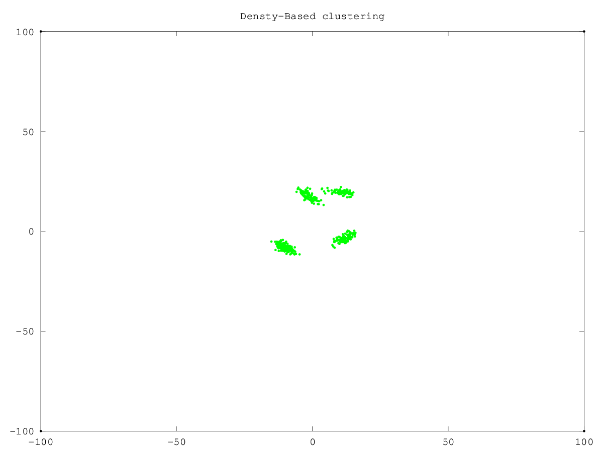\

```
radius = 256, minPts = 3
```

## 4.3. K-Means vs. DBSCAN Clustering

### 4.3.1. Sometimes when you run this demo, an entire row of model.W has NaN values. Why does this happen?

Occasionally, there will be no animals clustered into a cluster, and then when
the means are updated `mean([])` evaluates to `NaN`.

### 4.3.2. Modify this demo to use the density-based clustering method, and report the clusters obtained if you set minPoints to 3 and the radius such that it finds 5 clusters.

```
radius = 13, minPts = 3

Cluster 1: antelope horse moose ox sheep buffalo zebra deer pig cow
Cluster 2: dalmatian german+shepherd siamese+cat fox wolf chihuahua rat weasel bobcat collie
Cluster 3: hippopotamus elephant rhinoceros
Cluster 4: spider+monkey gorilla chimpanzee
Cluster 5: hamster rabbit mouse
```


