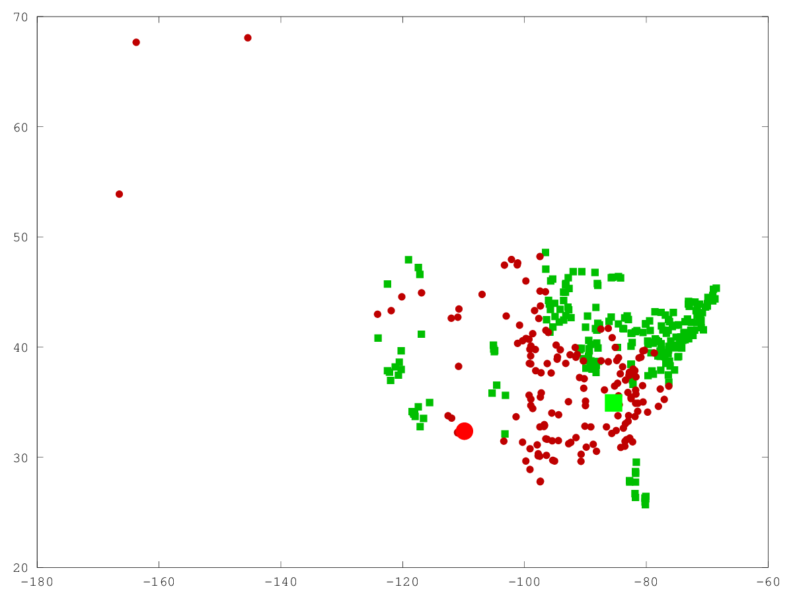
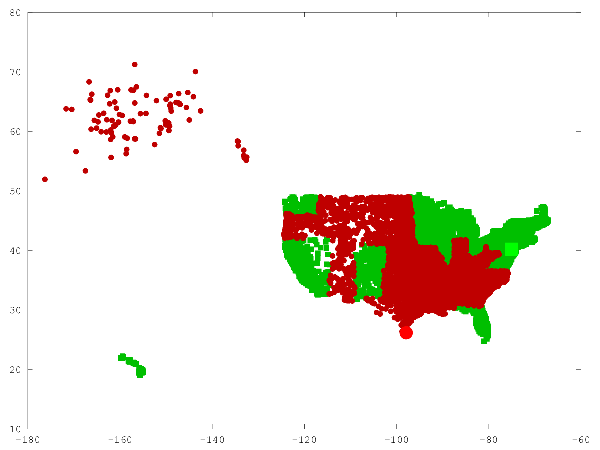

# 1 K-Nearest Neighbours
## 1.1 KNN Prediction

### 1.1.1 Handin your predict function.

```matlab
function [yhat] = predict(model,Xtest)
  % compute euclidian distance
  % distances = sum((model.X - Xtest).**2, 2);
  [n,d] = size(model.X);
  [t,d] = size(Xtest);

  distances = model.X.^2*ones(d,t) + ones(n,d)*(Xtest').^2 - 2*model.X*Xtest';
  yhat = zeros(t, 1);
  for c = 1:t
    [dists,  idx] = sort(distances(:, c));
    yhat(c) = mode(model.y(idx(1:model.k, :)));
  end
end
```

### 1.1.2 Report the training and test error obtained on the citiesSmall.mat dataset for k = 1, k = 3, and k = 10.

```
Training error with k-1 knn: 0.000
Test error with k-1 knn: 0.065
Training error with k-3 knn: 0.028
Test error with k-3 knn: 0.066
Training error with k-10 knn: 0.072
Test error with k-10 knn: 0.097
```

### 1.1.3 Hand in the plot generatied by classifier2Dplot on the citiesSmall.mat dataset for k = 1. (Note that this version of the function also plots the test data.)

\

### 1.1.4 Why is the training error 0 for k = 1?

Since all the training data forms the model, when k = 1 the training data
matches exactly the test data thus the distance is zero. It finds the exact
matching point in the training data.

### 1.1.5 If you didn’t have an explicit test set, how would you choose k?

You could split the training set in half and use one half for training and one
for testing. Alternatively you could make an educated guess for k.

## 1.2 Condensed Nearest Neighbours

### 1.2.1. Hand in your cnn.m code.

```matlab
function [model] = cnn(X,y,k)
  % [model] = cnn(X,y,k)
  %
  % Implementation of condensed-nearest neighbour classifer

  % Always add the first point as a start.
  model.X = X(1, :);
  model.y = y(1, :);
  model.k = k;
  model.c = max(y);
  model.predict = @predict;

  [n, d] = size(X);
  for i = 2:n
    if model.predict(model, X(i, :)) != y(i)
      model.X = [model.X; X(i, :)];
      model.y = [model.y; y(i)];
    end
  end
end

function [yhat] = predict(model,Xtest)
  % compute euclidian distance
  % distances = sum((model.X - Xtest).**2, 2);
  [n,d] = size(model.X);
  [t,d] = size(Xtest);

  distances = model.X.^2*ones(d,t) + ones(n,d)*(Xtest').^2 - 2*model.X*Xtest';
  yhat = zeros(t, 1);
  for c = 1:t
    [dists,  idx] = sort(distances(:, c));
    yhat(c) = mode(model.y(idx(1:min(n, model.k), :)));
  end
end
```

### 1.2.2. Report the training and testing errors, as well as the number of objects in the subset, on the citiesBig1.mat dataset with k = 1.

```
Number of objects in model 457 of 14735
Training error with k-1 cnn: 0.008
Test error with k-1 cnn: 0.018
```

### 1.2.3. Hand in the plot generated by classifier2Dplot on the citiesBig1.mat dataset for k = 1

\

### 1.2.4. Why is the training error with k = 1 now greater than 0?

It's now greater than zero because not all of the provided training points are
included in the model. Only those that improve the classifier score.

### 1.2.5. If you have s examples in the subset, what is the cost of running the predict function on t test examples in terms of n, d, t, and s?

It comes out to be $t * d * s$. Doesn't depend on n since s is a subset of n.

### 1.2.6. Try out your function on the dataset in citiesBig2.mat. Why are the test error and training error so high (even for k = 1) for this method on this dataset?

```
Training error with k-1 knn: 0.138
Test error with k-1 knn: 0.210
```

Probably because there's a lot of datapoints near the edge of regions. It has
lots of variation so is hard to predict.
