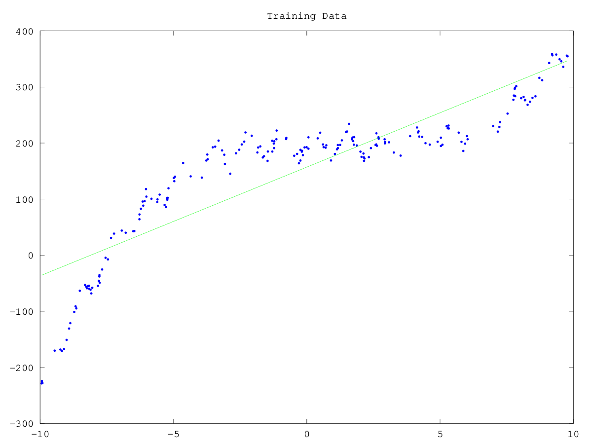

# CS340 - Assignment 3
Tristan Rice - q7w9a - 25886145

# 1. Vectors, Matrices, and Quadratic Functions

## 1.1. Basic Operations

1. $$x^Tx = 2*2 + 3*3 = 13$$

2. $$\lVert x \rVert^2 = (x^Tx)^2 = 169$$

3.  $$x^T(x+\alpha y) =
\begin{bmatrix}
2 & 3
\end{bmatrix}
\begin{bmatrix}
2 + 5*1 \\
3 + 5*4
\end{bmatrix}
= 2 *(2+5*1) + 3(3+5*4) = 83
$$

4. $$
Ax = \begin{bmatrix}
2*1 + 3*2 \\
2*2 + 3*3 \\
3*3 + 3*2
\end{bmatrix}
=
\begin{bmatrix}
8 \\
13 \\
15
\end{bmatrix}
$$

5. $$
z^TAx=
\begin{bmatrix}
2 & 0 & 1
\end{bmatrix}
Ax
= 2*8 + 0 * 13 + 1*15 = 31
$$

6. $$A^TA =
\begin{bmatrix}
1 & 2 & 3\\
2 & 3 & 2
\end{bmatrix}
\begin{bmatrix}
1 & 2\\
2 & 3\\
3 & 2
\end{bmatrix}
=
\begin{bmatrix}
1 *1 + 2*2 + 3*3 & 1 * 2 + 2 * 3 + 3 * 2 \\
1 * 2 + 2 * 3 + 3 * 2 & 2*2 + 3*3+2*2
\end{bmatrix}
=
\begin{bmatrix}
14 & 14 \\
14 & 17
\end{bmatrix}
$$

7. $yy^Ty=\lVert \rVert^2y$

8. $$x^TA^T(Ay+Az)=x^TA^TAy+z^TA^TAx$$

False. Using the distributed property of matrix multiplication.

$$x^TA^TAy + x^TA^TAz \neq x^TA^TAy+z^TA^TAx$$

9.

10. $$x^T(B+C) = Bx + Cx$$
$$x^TB + x^TC = Bx + Cx$$

TODO


# 2. Linear Regression and Nonlinear Bases
# 2.1. Adding a Bias Variable

```octave
function [model] = leastSquaresBias(X,y)

X = [ones(rows(X), 1) X];

% Solve least squares problem
w = (X'*X)\X'*y;

model.w = w;
model.predict = @predict;

end

function [yhat] = predict(model,Xhat)
Xhat = [ones(rows(Xhat), 1) Xhat];
w = model.w;
yhat = Xhat*w;
end
```

\

```
Training error = 3551.35
Test error = 3393.87
```

# 2.2. Polynomial Basis

```octave
function [model] = leastSquaresBasis(X,y,p)

X = polyBasis(X, p);

% Solve least squares problem
w = (X'*X)\X'*y;

model.w = w;
model.p = p;
model.predict = @predict;

end

function [yhat] = predict(model,Xhat)
Xhat = polyBasis(Xhat, model.p);
w = model.w;
yhat = Xhat*w;
end

function [Xpoly] = polyBasis(X, p)
Xpoly = [];
for i = 0:p
  Xpoly = [Xpoly X.^i];
end
end
```

```
p = 0:
Training error = 15480.52
Test error = 14390.76
p = 1:
Training error = 3551.35
Test error = 3393.87
p = 2:
Training error = 2167.99
Test error = 2480.73
p = 3:
Training error = 252.05
Test error = 242.80
p = 4:
Training error = 251.46
Test error = 242.13
p = 5:
Training error = 251.14
Test error = 239.54
p = 6:
Training error = 248.58
Test error = 246.01
p = 7:
Training error = 247.01
Test error = 242.89
p = 8:
Training error = 241.31
Test error = 245.97
warning: called from
    leastSquaresBasis at line 6 column 3
    example_basis_basis.m at line 12 column 9
warning: matrix singular to machine precision, rcond = 3.58289e-18
p = 9:
Training error = 7048.50
Test error = 7074.53
warning: matrix singular to machine precision, rcond = 3.03875e-20
warning: matrix singular to machine precision, rcond = 3.03875e-20
p = 10:
Training error = 14035.08
Test error = 12158.30
```

Increasing $p$ lowers the training error, but doesn't necessarily lower the test
error. With very high p values, the model becomes over fit and performs less
well. In addition, with $p=9,p=10$ Octave starts having rounding errors and thus
the model is no longer useful.

# 2.3. Manual Search for Optimal Basis

TODO

# 3. Non-Parametric Bases and Cross-Validation

TODO

# 4. Robust Regression and Gradient Descent

TODO

