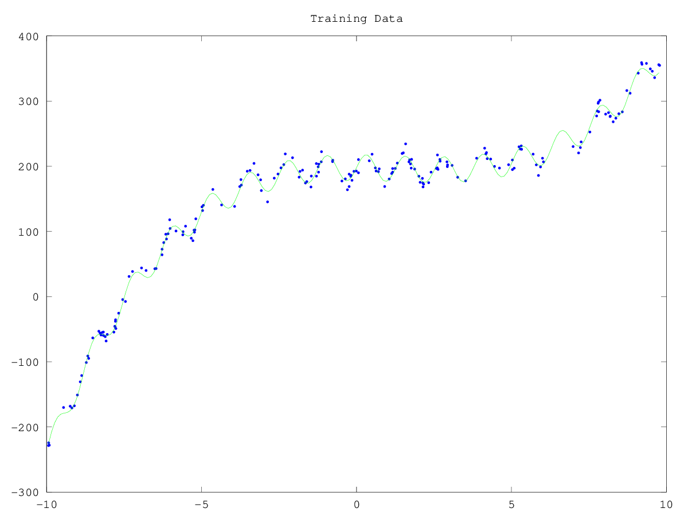

# CS340 - Assignment 3
Tristan Rice - q7w9a - 25886145

# 1. Vectors, Matrices, and Quadratic Functions

## 1.1. Basic Operations

1. $$x^Tx = 2*2 + 3*3 = 13$$

2. $$\lVert x \rVert^2 = (x^Tx)^2 = 169$$

3.  $$x^T(x+\alpha y) =
\begin{bmatrix}
2 & 3
\end{bmatrix}
\begin{bmatrix}
2 + 5*1 \\
3 + 5*4
\end{bmatrix}
= 2 *(2+5*1) + 3(3+5*4) = 83
$$

4. $$
Ax = \begin{bmatrix}
2*1 + 3*2 \\
2*2 + 3*3 \\
3*3 + 3*2
\end{bmatrix}
=
\begin{bmatrix}
8 \\
13 \\
15
\end{bmatrix}
$$

5. $$
z^TAx=
\begin{bmatrix}
2 & 0 & 1
\end{bmatrix}
Ax
= 2*8 + 0 * 13 + 1*15 = 31
$$

6. $$A^TA =
\begin{bmatrix}
1 & 2 & 3\\
2 & 3 & 2
\end{bmatrix}
\begin{bmatrix}
1 & 2\\
2 & 3\\
3 & 2
\end{bmatrix}
=
\begin{bmatrix}
1 *1 + 2*2 + 3*3 & 1 * 2 + 2 * 3 + 3 * 2 \\
1 * 2 + 2 * 3 + 3 * 2 & 2*2 + 3*3+2*2
\end{bmatrix}
=
\begin{bmatrix}
14 & 14 \\
14 & 17
\end{bmatrix}
$$

7. $yy^Ty=\lVert \rVert^2y$

8. $$x^TA^T(Ay+Az)=x^TA^TAy+z^TA^TAx$$

False. Using the distributed property of matrix multiplication.

$$x^TA^TAy + x^TA^TAz \neq x^TA^TAy+z^TA^TAx$$

9.

10. $$x^T(B+C) = Bx + Cx$$
$$x^TB + x^TC = Bx + Cx$$

TODO


# 2. Linear Regression and Nonlinear Bases
# 2.1. Adding a Bias Variable

```octave
function [model] = leastSquaresBias(X,y)

X = [ones(rows(X), 1) X];

% Solve least squares problem
w = (X'*X)\X'*y;

model.w = w;
model.predict = @predict;

end

function [yhat] = predict(model,Xhat)
Xhat = [ones(rows(Xhat), 1) Xhat];
w = model.w;
yhat = Xhat*w;
end
```

\

```
Training error = 3551.35
Test error = 3393.87
```

# 2.2. Polynomial Basis

```octave
function [model] = leastSquaresBasis(X,y,p)

X = polyBasis(X, p);

% Solve least squares problem
% We're using inv, since octave works better when dealing with large matrixes.
w = inv(X'*X)*X'*y;

model.w = w;
model.p = p;
model.predict = @predict;

end

function [yhat] = predict(model,Xhat)
Xhat = polyBasis(Xhat, model.p);
w = model.w;
yhat = Xhat*w;
end

function [Xpoly] = polyBasis(X, p)
Xpoly = [];
for i = 0:p
  Xpoly = [Xpoly X.^i];
end
end
```

```
p = 0:
Training error = 15480.52
Test error = 14390.76
p = 1:
Training error = 3551.35
Test error = 3393.87
p = 2:
Training error = 2167.99
Test error = 2480.73
p = 3:
Training error = 252.05
Test error = 242.80
p = 4:
Training error = 251.46
Test error = 242.13
p = 5:
Training error = 251.14
Test error = 239.54
p = 6:
Training error = 248.58
Test error = 246.01
p = 7:
Training error = 247.01
Test error = 242.89
p = 8:
Training error = 241.31
Test error = 245.97
p = 9:
Training error = 235.76
Test error = 259.30
p = 10:
Training error = 235.07
Test error = 256.30
```

Increasing $p$ lowers the training error, but doesn't necessarily lower the test
error. With very high p values, the model becomes over fit and performs less
well.

# 2.3. Manual Search for Optimal Basis

Fitting a $p=5$ Least Squares Basis and then adding $20*\sin(X*5)$ gives us

```
Training error = 50.99
Test error = 53.71
```

\

This is a pretty good fit. However, from the naked eye, it looks like it could be a bit
better.

I obtained this basis from using the best $p$ value from the previous question,
and then manually measuring the number of peaks. Manually counting the number of
peaks and then estimating the height of them gives a pretty good estimate for
the coefficients for the sin term.

# 3. Non-Parametric Bases and Cross-Validation

## 3.1. Proper Training and Validation Sets

The issue is that the training and validation sets aren't both representative of
the whole dataset since they're respectively the first and second half of it. If
you instead randomize the selection it works much better and is a better
representation of the dataset.

```octave
ordering = randperm(n);
X = X(ordering,:);
y = y(ordering,:);
Xtrain = X(1:n/2,:);
ytrain = y(1:n/2,:);
Xvalid = X(n/2+1:end,:);
yvalid = y(n/2+1:end,:);
```

```
Training error = 39.49
Test error = 71.17
```

## 3.2. Cross-Validation

```octave
% Load data
load basisData.mat % Loads X and y
[n,d] = size(X);

% Split training data into a training and a validation set
ordering = randperm(n);
X = X(ordering,:);
y = y(ordering,:);

valsize = n/10;

bestSigmas = [];

for cv=1:10
    validation = ((cv-1)*valsize+1):((cv)*valsize);
    training = setdiff(1:n, validation);
    Xtrain = X(training,:);
    ytrain = y(training,:);
    Xvalid = X(validation,:);
    yvalid = y(validation,:);

    % Find best value of RBF kernel parameter,
    %   training on the train set and validating on the validation set
    minErr = inf;
    for sigma = 2.^[-15:15]

        % Train on the training set
        model = leastSquaresRBF(Xtrain,ytrain,sigma);

        % Compute the error on the validation set
        yhat = model.predict(model,Xvalid);
        validError = sum((yhat - yvalid).^2)/(n/2);
        fprintf('Error with sigma = %.3e = %.2f\n',sigma,validError);

        % Keep track of the lowest validation error
        if validError < minErr
            minErr = validError;
            bestSigma = sigma;
        end
    end
    fprintf('Value of sigma that achieved the lowest validation error was %.3e\n',bestSigma);
    bestSigmas = [bestSigmas bestSigma];
end

bestSigma = mean(bestSigmas)

% Now fit the model based on the full dataset.
fprintf('Refitting on full training set...\n');
model = leastSquaresRBF(X,y,bestSigma);

% Compute training error
yhat = model.predict(model,X);
trainError = sum((yhat - y).^2)/n;
fprintf('Training error = %.2f\n',trainError);

% Finally, report the error on the test set
t = size(Xtest,1);
yhat = model.predict(model,Xtest);
testError = sum((yhat - ytest).^2)/t;
fprintf('Test error = %.2f\n',testError);
```

Typical output

```
bestSigma =  0.95000
Refitting on full training set...
Training error = 39.16
Test error = 63.29
```

The best $\sigma$ value is typically 0.95, but is sometimes 1 or 0.9.


## 3.3. Cost of Non-Parametric Bases

TODO

## 3.4. Non-Parametric Bases with Uneven Data

TODO

# 4. Robust Regression and Gradient Descent

TODO

