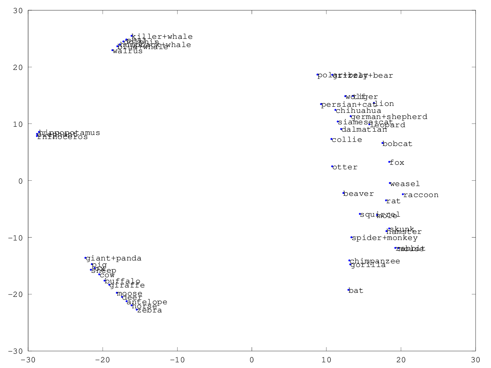

# CPSC 340 Assignment 5
Tristan Rice, 25886145, q7w9a

I'm using one late day to turn in the assignment the Monday after the original
Saturday 2pm due date. I'll have 2 late days remaining after this.

## 1 Principal Component Analysis

### 1.1 PCA by Hand

| $x_1$ | $x_2$ |
|-------|-------|
| -2    | -1    |
| -1    | 0     |
| 0     | 1     |
| 1     | 2     |
| 2     | 3     |


#### 1. What is the first principal component?

Mean is (0, 1).

Centered:

| $x_1$ | $x_2$ |
|-------|-------|
| -2    | -2    |
| -1    | -1    |
| 0     | 0     |
| 1     | 1     |
| 2     | 2     |

You can fit a line through this perfectly, since it's just $x_1 = (x_2-1)$.

#### 2. What is the (L2-norm) reconstruction error of the point (3,3)? (Show your work.)

We need to calculate the orthogonal L2 distance between the first principle
component. We can do this with the equation:
$$
distance(ax +by+c=0, (x_0,y_0)) = \frac{|ax_0+by_0+c|}{\sqrt{a^2+b^2}}
$$

$$
distance(x_1 - x_2 + 1=0, (3,3)) = \frac{|3 - 3 + 1|}{\sqrt{1^2+(-1)^2}} = \frac{0}{\sqrt{2}} = 0.7071
$$

#### 3. What is the (L2-norm) reconstruction error of the point (3,4)? (Show your work.)

$$
distance(x_1 - x_2 + 1=0, (3,4)) = \frac{|3 - 4 + 1|}{\sqrt{1^2+(-1)^2}} = \frac{0}{\sqrt{2}} = 0
$$

### 1.2 Data Visualization

### 1.3 Data Compression

## 2 PCA Generalizations

### 2.1 Robust PCA

dimRedPCA_alternate.m
``` octave
function [model] = dimRedPCA_alternate(X,k)

[n,d] = size(X);

% Subtract mean
mu = mean(X);
X = X - repmat(mu,[n 1]);

% Initialize W and Z
W = randn(k,d);
Z = randn(n,k);

R = Z*W-X;
f = sum(sum(R.^2));
for iter = 1:50
    fOld = f;

    % Update Z
    Z(:) = findMin(@funObjZ,Z(:),10,0,X,W);

    % Update W
    W(:) = findMin(@funObjW,W(:),10,0,X,Z);

    R = Z*W-X;
    f = sum(sum(R.^2));
    fprintf('Iteration %d, loss = %.5e\n',iter,f);

    if fOld - f < 1e-4
        break;
    end
end

model.mu = mu;
model.W = W;
model.compress = @compress;
model.expand = @expand;
end

function [Z] = compress(model,X)
[t,d] = size(X);
mu = model.mu;
W = model.W;
k = size(W,1);

X = X - repmat(mu,[t 1]);
% We didn't enforce that W was orthogonal so we need to optimize to find Z
Z = zeros(t,k);
Z(:) = findMin(@funObjZ,Z(:),100,0,X,W);
end

function [X] = expand(model,Z)
[t,d] = size(Z);
mu = model.mu;
W = model.W;

X = Z*W + repmat(mu,[t 1]);
end

function [f,g] = funObjW(W,X,Z)
% Resize vector of parameters into matrix
d = size(X,2);
k = size(Z,2);
W = reshape(W,[k d]);

% Compute function value
R = Z*W-X;
epsilon = 0.0001
% f = sum(sum(R.^2));
f = sum(sum(sqrt(R.^2+epsilon)));

% Compute derivative with respect to each residual
dR = R;

% Multiply by Z' to get elemetns of gradient
g = Z'*dR;

% Return a vector
g = g(:);
end

function [f,g] = funObjZ(Z,X,W)
% Resize vector of parameters into matrix
n = size(X,1);
k = size(W,1);
Z = reshape(Z,[n k]);

% Compute function value
R = Z*W-X;
% f = sum(sum(R.^2));
f = sum(sum(sqrt(R.^2+epsilon)));

% Compute derivative with respect to each residual
dR = R;

% Multiply by W' to get elemetns of gradient
g = dR*W';

% Return a vector
g = g(:);
end
```

### 2.2 L1-Regularized and Binary Latent-Factor Models

#### 1. What is the effect of λW on the sparsity of the parameters W and Z? What is the effect of λZ on the sparsity of W and Z?

Increasing $\lambda_W$ will increase the sparsity of W and will have little
effect on Z. Increasing $\lambda_Z$ will increase the sparsity of Z and have
little effect on W.

#### 2. What is the effect of λZ on the two parts of the fundamental trade-off in machine learning? What is the effect of k on the two parts?

Since increasing $\lambda_Z$ makes $Z$ sparser, that means it is using fewer
features to represent the data. This likely will increase the test error, as it
can't fit the test data exactly, but make the test error more representative of
the validation error as it prevents overfitting. If $\lambda_Z$ is too large, it
will likely increase both test error and validation error.

#### 3. Would the answers to (2) change if λW = 0?

When $\lambda_W = 0$, it is equivalent to having no L1-regularizer on W. Thus,
you could potentially get no benefit from having the L2-regularizer on Z since
those large weights could be shifted into W instead. The net effect will be the
same no matter what $\lambda_Z$ is.

#### 4. Suppose each element of the matrix X is either +1 or −1 and our goal is to build a model that makes the sign of w T j zi match the sign of xij . Write down a (continuous) objective function that would be more suitable.

If we're trying to match the signs, this becomes a classification problem. One
good continuous loss function for classification is logistic loss.

Since the logistic loss is between 0 and 1 and not -1 and +1, we first have to
scale the inputs.

$$
f(Z, W) = \sum_{(i,j)\in R} \log(1+\exp(-w_j^Tz_i(x_{ij}+1)/2))
+ \text{W, Z regularizers}
$$


## 3 Multi-Dimensional Scaling

### 3.1 ISOMAP

``` octave
function [Z] = visualizeISOMAP(X,k,names)

[n,d] = size(X);

% Compute all distances
D = X.^2*ones(d,n) + ones(n,d)*(X').^2 - 2*X*X';
D = sqrt(abs(D));

DE = zeros(n, n);

for i = 1:n
    [v, j] = sort(D(i, :));
    DE(i, j(2:4)) = v(2:4);
    DE(j(2:4), i) = v(2:4);
end

for i = 1:n
    for j = (i+1):n
        i
        j
        dist = dijkstra(DE,i,j);
        D(i,j) = dist;
        D(j,i) = dist;
    end
end

% Initialize low-dimensional representation with PCA
model = dimRedPCA(X,2);
Z = model.compress(model,X);

Z(:) = findMin(@stress,Z(:),500,0,D,names);

end

function [f,g] = stress(Z,D,names)

n = length(D);
k = numel(Z)/n;

Z = reshape(Z,[n k]);

f = 0;
g = zeros(n,k);
for i = 1:n
    for j = i+1:n
        % Objective Function
        Dz = norm(Z(i,:)-Z(j,:));
        s = D(i,j) - Dz;
        f = f + (1/2)*s^2;

        % Gradient
        df = s;
        dgi = (Z(i,:)-Z(j,:))/Dz;
        dgj = (Z(j,:)-Z(i,:))/Dz;
        g(i,:) = g(i,:) - df*dgi;
        g(j,:) = g(j,:) - df*dgj;
    end
end
g = g(:);

% Make plot if using 2D representation
if k == 2
    figure(3);
    clf;
    plot(Z(:,1),Z(:,2),'.');
    if ~isempty(names)
        hold on;
        for i = 1:n
            text(Z(i,1),Z(i,2),names(i,:));
        end
    end
    pause(.01)
end
end
```

\

### 3.2 ISOMAP with Disconnected Graph


``` octave
function [Z] = visualizeISOMAP(X,k,names)

[n,d] = size(X);

% Compute all distances
D = X.^2*ones(d,n) + ones(n,d)*(X').^2 - 2*X*X';
D = sqrt(abs(D));

DE = zeros(n, n);

for i = 1:n
    [v, j] = sort(D(i, :));
    DE(i, j(2:3)) = v(2:3);
    DE(j(2:3), i) = v(2:3);
end

for i = 1:n
    for j = (i+1):n
        i
        j
        dist = dijkstra(DE,i,j);
        D(i,j) = dist;
        D(j,i) = dist;
    end
end

% Get rid of max infs.
D(D==inf) = max(D(D!=inf))

% Initialize low-dimensional representation with PCA
model = dimRedPCA(X,2);
Z = model.compress(model,X);

Z(:) = findMin(@stress,Z(:),500,0,D,names);

end

function [f,g] = stress(Z,D,names)

n = length(D);
k = numel(Z)/n;

Z = reshape(Z,[n k]);

f = 0;
g = zeros(n,k);
for i = 1:n
    for j = i+1:n
        % Objective Function
        Dz = norm(Z(i,:)-Z(j,:));
        s = D(i,j) - Dz;
        f = f + (1/2)*s^2;

        % Gradient
        df = s;
        dgi = (Z(i,:)-Z(j,:))/Dz;
        dgj = (Z(j,:)-Z(i,:))/Dz;
        g(i,:) = g(i,:) - df*dgi;
        g(j,:) = g(j,:) - df*dgj;
    end
end
g = g(:);

% Make plot if using 2D representation
if k == 2
    figure(3);
    clf;
    plot(Z(:,1),Z(:,2),'.');
    if ~isempty(names)
        hold on;
        for i = 1:n
            text(Z(i,1),Z(i,2),names(i,:));
        end
    end
    pause(.01)
end
end
```

\
