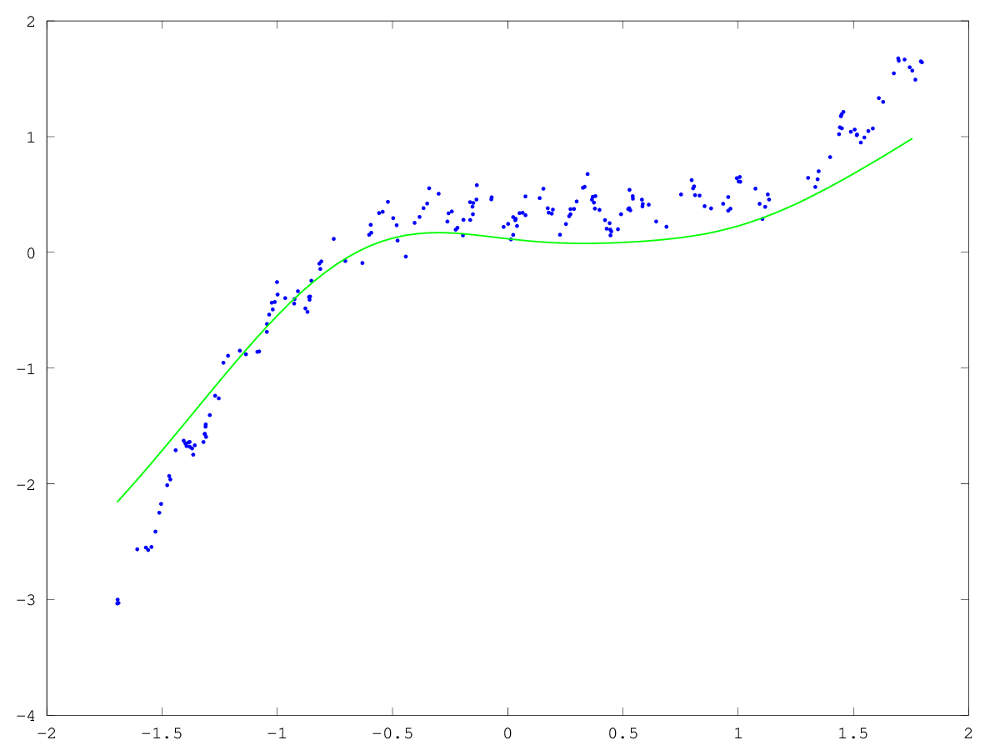

# CPSC 340 - Assignment 6
Tristan Rice, q7w9a, 25886145

I'm using my last two late days to turn this in on Wednesday Dec 7th.

## 1 PageRank

### 1. Hand in your code implementing the random walk algorithm.
```octave
function [ranks] = pagerank(X, alpha, t)
n = rows(unique(X));

adj = zeros(n,n);
ranks = zeros(n,1);

for i = 1:rows(X)
  adj(X(i,1),X(i,2)) = 1;
  adj(X(i,2),X(i,1)) = 1;
end

current = ceil(rand()*n);
for i=1:t
  if rand < alpha
    current = ceil(rand()*n);
  else
    candidates = find(adj(current,:)==1);
    current = candidates(ceil(rand()*columns(candidates)));
  end
  ranks(current) += 1;
end

ranks = ranks./ sum(ranks);
end
```

Code used for answering the questions below:

```octave
load arrowhead.mat

alpha = 0.1;
ranks = pagerank(X, alpha, 1000000);
[largest, i] = max(ranks)
largest = names(i)
med = median(ranks)

names(64)
ranks(64)
```

### 2. Who is the person with the largest PageRank?

The person with the largest page rank is "Golub with a rank of 0.088345.

### 3. If you normalize the PageRanks so that they sum up to 1, what is the median PageRank value?

The median page rank is 0.0077470.

### 4. What is the (normalized) PageRank of the inventor of Matlab?

The page rank of Moler is 0.018057.

## 2 Neural Networks

Changes made:

- Used `1.7159*tanh(2/3*x)` as activation function.
- Use a decreasing step size `O(1/(1+a*sqrt(t)))`.
- Added momentum.
- Added basis to X and on each hidden layer.
- Added per weight learning rates equal to `sqrt(# layer inputs)*sqrt(layer #)`.
- Mini-batches of 3.
- Initialized weights to `1/sqrt(# layer inputs)`.
- `nHidden = [200 200]`
- 20000 iterations.
- Normalize X and y to have mean of 0 and a variance of 1.
- Compute training error to have empirical evidence for things.


Changes made and not used due to not increasing fit:

- Added L2 regularizer (increased test error).
- Increasing batch size over time.
- Training with the furthest points away.
- Sigmoid activation function.
- ReLU activation function.
- findMin

\


A number of things were tried from the paper "Efficient BackProp" by Yann LeCun,
Leon Bottou, Genevieve B. Orr and Klaus-Robert Miller.

http://yann.lecun.com/exdb/publis/pdf/lecun-98b.pdf

### Code

#### example_nnet.m

```octave
load basisData.mat

[n,d] = size(X);

% Choose network structure
nHidden = [200 200];

% Train with stochastic gradient
maxIter = 30000;
stepSize = 1e-5;
batchSizeRandom = 3;
batchSizeWorst = 0;
batchRate = 0;%(n-batchSize)/maxIter;
momentum = 0.2;
tscale = 0.001;


% Normalize data
global centerX = mean(X);
global scaleX = 1/sqrt(var(X));
global centerY = mean(y);
global scaleY = 1/sqrt(var(y));

%var(X)
%var(y)

function [X, y] = transform(X, y)
  global centerX;
  global scaleX;
  global centerY;
  global scaleY;
  X = (X-centerX)*scaleX;
  y = (y-centerY)*scaleY;
end

[X, y] = transform(X, y);
[Xtest, ytest] = transform(Xtest, ytest);

minX = min(X)
maxX = max(X)


% Add bias variable to first layer.
d+=1;

% Helper functions
function xb = applyBasis(X)
  xb = [ones(rows(X),1) X];
end

function [w] = zeroBasisRow(w, d, nHidden)
  startIndex = d*nHidden(1);
  for layer = 2:length(nHidden)
    for column = 1:nHidden(layer)
      w(startIndex+(nHidden(layer-1))*column) = 0;
    end
    startIndex = startIndex+nHidden(layer-1)*nHidden(layer);
  end
end

function n = randnormal(n, m, stdev)
  n = stdev.*randn(n,1) + m;
end

% Count number of parameters and initialize weights 'w', and learning rates
nParams = d*nHidden(1);
w = randnormal(nParams, 0, 1/sqrt(d));
learningRates = ones(nParams,1)*sqrt(d);
for h = 2:length(nHidden)
  connectionsIn = nHidden(h-1)
  added = connectionsIn*nHidden(h)
  w = [w; randnormal(added, 0, 1/sqrt(connectionsIn))];
  learningRates = [learningRates; ones(added, 1)*sqrt(connectionsIn)*sqrt(h)];
  nParams = nParams+added;
end
nParams = nParams+nHidden(end);
w = [w; randnormal(nHidden(end), 0, 1/sqrt(nHidden(length(nHidden)-1)))];
learningRates = [learningRates; ones(nHidden(end), 1)*sqrt(nHidden(length(nHidden)-1))];

w = zeroBasisRow(w, d, nHidden);
prevw = w;

bestw = [];
bestwscore = inf;

errors = ones(n,1)*inf;

funObj = @(w,i)MLPregressionLoss(w,applyBasis(X(i,:)),y(i),nHidden);
for t = 1:maxIter

    % The actual stochastic gradient algorithm:

    i = [];

    % Random mini-batches.
    i = [i ceil(rand(batchSizeRandom)*n)];

    % Worst mini-batches.
    if batchSizeWorst > 0
      [_, worst] = sort(errors(:),'descend');
      i = [i worst(1:batchSizeWorst, :)];
    end

    batchSizeRandom += batchRate;
    batchSizeWorst += batchRate;
    [f,g] = funObj(w,i);
    g = zeroBasisRow(g, d, nHidden);
    alphat = stepSize/sqrt(1+tscale*(t-1));
    betat = momentum;
    tmpw = w;
    w = w - alphat*g.*learningRates + betat*(w-prevw);
    prevw = tmpw;

    if batchSizeWorst > 0
      yhat = MLPregressionPredict(w,applyBasis(X(i,:)),nHidden);
      errors(i) = (yhat - y(i,:)).^2;
  end

    % Every few iterations, plot the data/model:
    if mod(t-1,round(maxIter/50)) == 0
        figure(1);clf;hold on
        Xhat = [minX:.05:maxX]';
        yhat = MLPregressionPredict(w,applyBasis(Xhat),nHidden);
        plot(X,y,'.');
        h=plot(Xhat,yhat,'g-','LineWidth',3);
        drawnow;

        % Compute training error
        yhat = MLPregressionPredict(w,applyBasis(X),nHidden);
        trainError = sum((yhat - y).^2)./rows(y);

        if trainError < bestwscore
          bestw = w;
          bestwscore = trainError;
        end

        fprintf('Training iteration = %d\n',t-1);
        fprintf('Training error = %.4f\n',trainError);
        fprintf('Alpha = %f, Beta = %f, W = %f\n', alphat, betat, sum(abs(w)));
    end

end

figure(1);clf;hold on
Xhat = [minX:.05:maxX]';
yhat = MLPregressionPredict(bestw,applyBasis(Xhat),nHidden);
plot(X,y,'.');
h=plot(Xhat,yhat,'g-','LineWidth',3);
drawnow;

% Compute test error
yhat = MLPregressionPredict(bestw,Xtest,nHidden);
testError = sum((yhat - ytest).^2)./rows(ytest);
fprintf('Test error = %.2f\n',testError);

print -dpng ./2.png
```

#### MLPregressionLoss.m

``` octave
function [f,g] = MLPregressionLoss(Ww,X,y,nHidden)

[nInstances,nVars] = size(X);

% Form Weights
W1 = reshape(Ww(1:nVars*nHidden(1)),nVars,nHidden(1)); % Weight matrix W(1)
startIndex = nVars*nHidden(1);
for layer = 2:length(nHidden) % Weight matrix W(m) for m > 1
  r = nHidden(layer-1); % add row for bias variable
  c = nHidden(layer);
  lw = reshape(Ww(startIndex+1:startIndex+r*c),r,c);
  Wm{layer-1} = lw;
  startIndex = startIndex+nHidden(layer-1)*nHidden(layer);
end
w = Ww(startIndex+1:startIndex+nHidden(end)); % Final weight vector 'w'

h = @(z) 1.7159*tanh(2/3*z); % Activation function
dh = @(z) 1.14393*sech(2/3*z).^2; % Derivative of activiation function

% Use sigmoid for activation function instead.
%h = @sigmoid;
%dh = @(z) sigmoid(z).*(1-sigmoid(z));

% ReLU
%h = @(x) (x >= 0).*x + 0;
%dh = @(x) (x >= 0).*(x.^0) + 0;

% Initialize gradient vector
f = 0;
if nargout > 1
    gradInput = zeros(size(W1));
    for layer = 2:length(nHidden)
       gradHidden{layer-1} = zeros(size(Wm{layer-1}));
    end
    gradOutput = zeros(size(w));
end

% Compute Output
for i = 1:nInstances
    innerProduct{1} = X(i,:)*W1;
    z{1} = h(innerProduct{1});
    for layer = 2:length(nHidden)
        innerProduct{layer} = z{layer-1}*Wm{layer-1};
        z{layer} = h(innerProduct{layer});
    end
    yhat = z{end}*w;

    r = yhat-y(i);
    f = f + r^2;

    if nargout > 1
        dr = 2*r;
        err = dr;

        % Output Weights
        gradOutput = gradOutput + err*z{end}';

        if length(nHidden) > 1
            % Last Layer of Hidden Weights
            backprop = err*(dh(innerProduct{end}).*w');
            gradHidden{end} = gradHidden{end} + z{end-1}'*backprop;

            % Other Hidden Layers
            for layer = length(nHidden)-2:-1:1
                backprop = (backprop*Wm{layer+1}').*dh(innerProduct{layer+1});
                gradHidden{layer} = gradHidden{layer} + z{layer}'*backprop;
            end

            % Input Weights
            backprop = (backprop*Wm{1}').*dh(innerProduct{1});
            gradInput = gradInput + X(i,:)'*backprop;
        else
            % Input Weights
            gradInput = gradInput + err*X(i,:)'*(dh(innerProduct{end}).*w');
        end

    end

end

% Put Gradient into vector
if nargout > 1
    g = zeros(size(Ww));
    g(1:nVars*nHidden(1)) = gradInput(:);
    startIndex = nVars*nHidden(1);
    for layer = 2:length(nHidden)
        g(startIndex+1:startIndex+nHidden(layer-1)*nHidden(layer)) = gradHidden{layer-1};
        startIndex = startIndex+nHidden(layer-1)*nHidden(layer);
    end
    g(startIndex+1:startIndex+nHidden(end)) = gradOutput;
end

% Add an L2 regularizer.
%f += sum(Ww.^2);
%g += 2*Ww;

end

function [z] = sigmoid(y)
z = ones(size(y))./(1+exp(-y));
end
```
